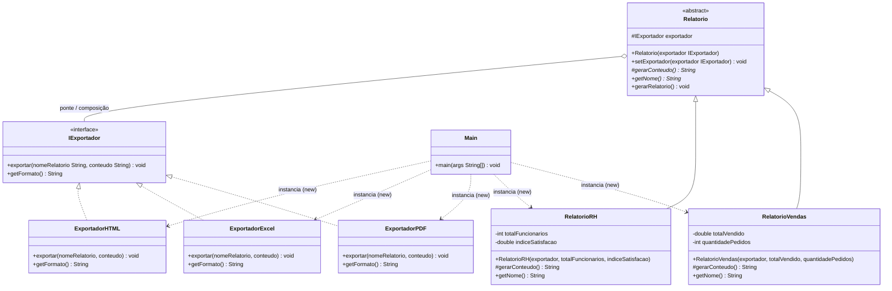
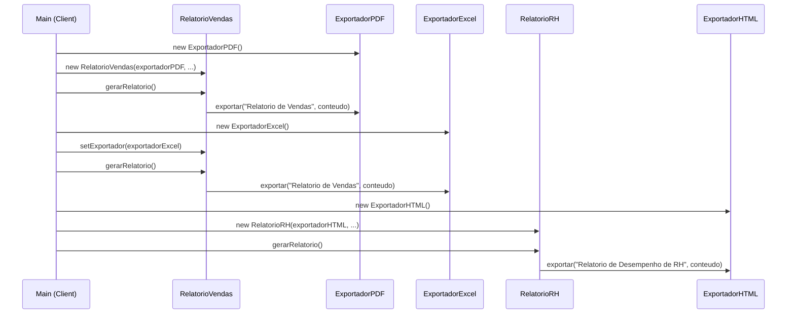

# TechFatec BI — Módulo de Relatórios (Padrão Bridge)

Expansão do módulo de relatórios do sistema de inteligência de negócios da TechFatec.
O sistema legado só gerava o **Relatório de Vendas** em **PDF**. Este projeto refatora
o módulo com o **Design Pattern Bridge** para que:

- qualquer **tipo de relatório** (Vendas, RH, e futuros) possa ser exportado para
- qualquer **formato** (PDF, Excel/XLSX, HTML, e futuros)

sem explosão de subclasses (`RelatorioVendasPDF`, `RelatorioVendasExcel`,
`RelatorioRHPDF`, `RelatorioRHExcel`...) e respeitando o **Princípio Aberto/Fechado (OCP)**
do SOLID: o código existente não é alterado para adicionar um novo relatório
ou um novo formato — apenas se estende com uma nova classe.

## Por que Bridge e não Herança simples?

Se a variação "tipo de relatório × formato de exportação" fosse resolvida só com
herança, cada combinação nova exigiria uma nova classe (crescimento **multiplicativo**:
2 relatórios × 3 formatos = 6 classes; 3 relatórios × 4 formatos = 12 classes...).

O Bridge separa as duas dimensões em **duas hierarquias independentes** e as conecta
por composição (a "ponte"): a classe `Relatorio` guarda uma referência a um
`IExportador` e delega a ele a etapa de exportação, em vez de implementá-la.
Crescimento passa a ser **aditivo**: uma nova classe por relatório, uma nova classe
por formato.

## Diagrama de classes



- **Abstraction**: `Relatorio` (abstrata) → guarda a referência ao `IExportador`.
- **Refined Abstractions**: `RelatorioVendas`, `RelatorioRH`.
- **Implementor**: `IExportador` (interface).
- **Concrete Implementors**: `ExportadorPDF`, `ExportadorExcel`, `ExportadorHTML`.
- **Client**: `Main`, o único ponto do sistema onde há `new` de classes concretas.

## Fluxo de execução (sequência)



## Estrutura de diretórios

```
techfatec-relatorios/
├── src/
│   ├── abstracao/          # Hierarquia de Relatórios (Abstraction)
│   │   ├── Relatorio.java
│   │   ├── RelatorioVendas.java
│   │   └── RelatorioRH.java
│   ├── implementacao/      # Hierarquia de Exportadores (Implementor)
│   │   ├── IExportador.java
│   │   ├── ExportadorPDF.java
│   │   ├── ExportadorExcel.java
│   │   └── ExportadorHTML.java
│   └── cliente/            # Script de validação
│       └── Main.java
└── README.md
```

## Injeção de dependência

Nenhuma classe de `abstracao/` faz `new` de um exportador concreto. O construtor
de `Relatorio` (e das subclasses) **recebe** um `IExportador` já pronto:

```java
protected Relatorio(IExportador exportador) {
    this.exportador = exportador;
}
```

A troca de formato em tempo de execução é feita pelo método `setExportador`,
sem recriar o objeto `Relatorio` e sem que ele saiba qual classe concreta está
por trás da interface:

```java
relatorioVendas.setExportador(new ExportadorExcel());
```

Toda instanciação concreta (`new ExportadorPDF()`, `new RelatorioVendas(...)` etc.)
acontece **apenas** em `cliente/Main.java`.

## Como compilar e executar

```bash
# a partir da raiz do projeto
javac -d bin src/implementacao/*.java src/abstracao/*.java src/cliente/*.java
java -cp bin cliente.Main
```

### Saída esperada (resumo)

1. `Relatorio de Vendas` exportado em **PDF**.
2. O **mesmo objeto** `relatorioVendas`, com o exportador trocado em runtime,
   exportado em **Excel (XLSX)**.
3. `Relatorio de Desempenho de RH` exportado em **HTML**.

## Extensibilidade (OCP na prática)

- **Novo formato** (ex.: CSV): criar `ExportadorCSV implements IExportador`.
  Nenhuma classe de `abstracao/` precisa ser tocada.
- **Novo relatório** (ex.: Relatório Financeiro): criar
  `RelatorioFinanceiro extends Relatorio`. Nenhuma classe de `implementacao/`
  precisa ser tocada.
- Em nenhum dos dois casos há alteração de código já existente — apenas adição
  de classes novas, exatamente como pede o Princípio Aberto/Fechado.
