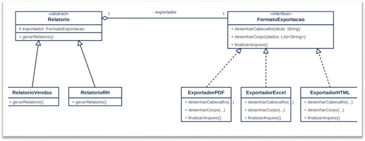
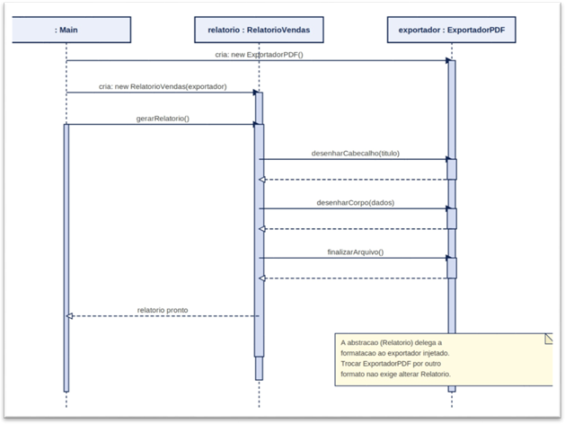

# TechFatec BI — Módulo de Relatórios (Padrão Bridge)

Expansão do módulo de relatórios do sistema de inteligência de negócios da TechFatec.

O sistema legado só gerava o **Relatório de Vendas** em **PDF**. Este projeto refatora o módulo com o **Design Pattern Bridge** para que:

- qualquer **tipo de relatório** (Vendas, RH e futuros) possa ser exportado para
- qualquer **formato** (PDF, Excel/XLSX, HTML e futuros)

sem explosão de subclasses (`RelatorioVendasPDF`, `RelatorioVendasExcel`, `RelatorioRHPDF`, `RelatorioRHExcel`...) e respeitando o **Princípio Aberto/Fechado (OCP)** do SOLID.

## Dupla

* Henrique de Moraes Rodrigues

* Miguel Gustavo de Sousa Campos

## Por que Bridge e não Herança simples?

Se a variação "tipo de relatório × formato de exportação" fosse resolvida só com herança, cada combinação nova exigiria uma nova classe.

O Bridge separa essas duas dimensões em **duas hierarquias independentes** e as conecta por agregação: a classe `Relatorio` guarda uma referência a um `FormatoExportacao` e delega a ele a etapa de exportação.

## Diagrama de classes



O diagrama separa o problema em duas hierarquias independentes, ligadas por agregação — a essência do padrão Bridge.

- **Abstraction**: `Relatorio` (abstrata) → guarda a referência ao `FormatoExportacao`.
- **Refined Abstractions**: `RelatorioVendas`, `RelatorioRH`.
- **Implementor**: `FormatoExportacao` (interface).
- **Concrete Implementors**: `ExportadorPDF`, `ExportadorExcel`, `ExportadorHTML`.
- **Client**: `Main`.

## Fluxo de execução — Diagrama de sequência



O diagrama de sequência mostra a instanciação do exportador, a criação do relatório com injeção de dependência e a delegação das etapas de exportação (`desenharCabecalho`, `desenharCorpo` e `finalizarArquivo`).

A principal vantagem é que o mesmo relatório pode utilizar diferentes formatos de exportação sem alterar as classes da hierarquia de relatórios.

## Estrutura de diretórios

```text
README.md
└── techfatec-relatorios/
    ├── diagramas/
    │   ├── diagrama-classe.png
    │   └── diagrama-sequencia.png
    └── src/
        ├── abstracao/
        │   ├── Relatorio.java
        │   ├── RelatorioVendas.java
        │   └── RelatorioRH.java
        ├── implementacao/
        │   ├── IExportador.java
        │   ├── ExportadorPDF.java
        │   ├── ExportadorExcel.java
        │   └── ExportadorHTML.java
        └── cliente/
            └── Main.java
```

## Injeção de dependência

Nenhuma classe de `abstracao/` faz `new` de um exportador concreto. O construtor de `Relatorio` recebe um `FormatoExportacao` já pronto:

```java
protected Relatorio(FormatoExportacao exportador) {
    this.exportador = exportador;
}
```

A troca de formato em tempo de execução pode ser feita com:

```java
relatorioVendas.setExportador(new ExportadorExcel());
```

Toda instanciação concreta acontece no `cliente/Main.java`.

## Como compilar e executar

```bash
javac -d bin src/implementacao/*.java src/abstracao/*.java src/cliente/*.java
java -cp bin cliente.Main
```

## Saída esperada

1. `Relatorio de Vendas` exportado em **PDF**.
2. O mesmo objeto `relatorioVendas` com o exportador trocado em runtime e exportado em **Excel (XLSX)**.
3. `Relatorio de Desempenho de RH` exportado em **HTML**.

## Extensibilidade — OCP na prática

- **Novo formato**: criar `ExportadorCSV implements FormatoExportacao`.
- **Novo relatório**: criar `RelatorioFinanceiro extends Relatorio`.
- As duas extensões podem ser adicionadas sem modificar as classes existentes das outras hierarquias.
